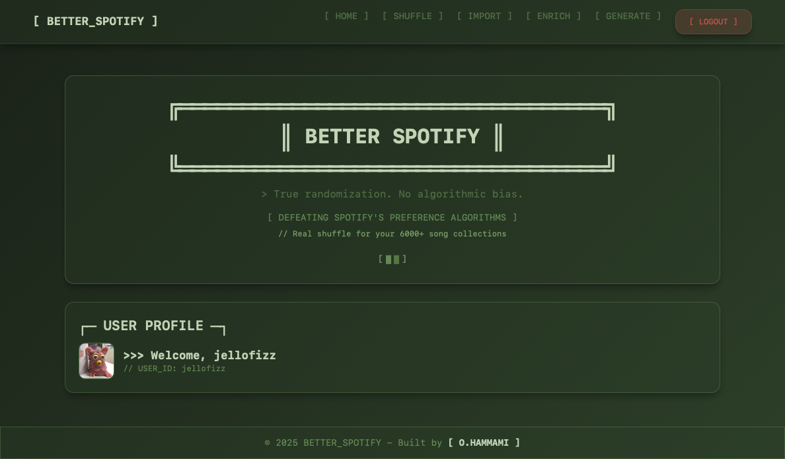
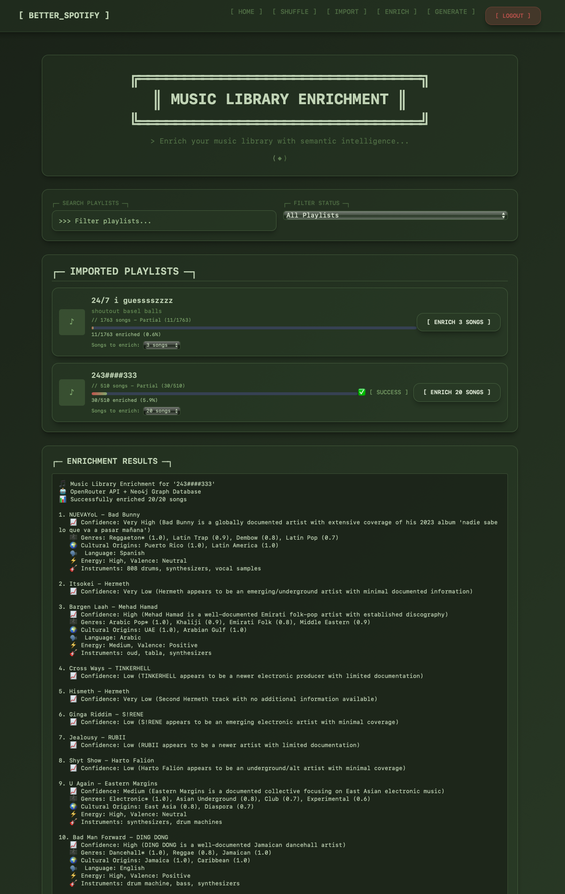
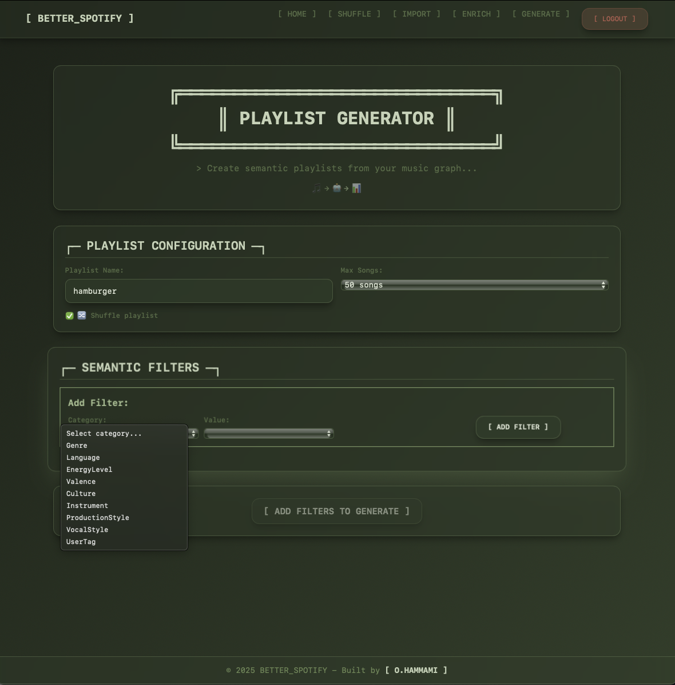
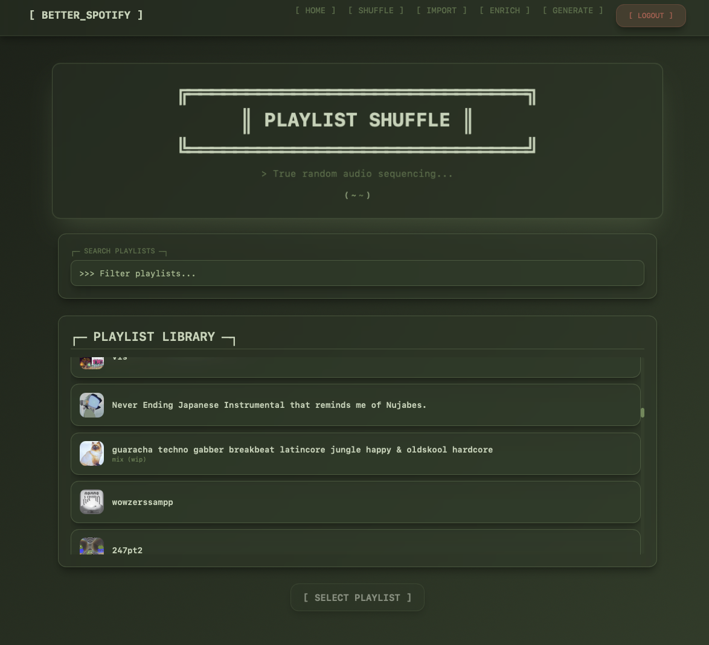

# Betterd Spotify 🎵🤖

**A neurosymbolic music intelligence system that transforms your Spotify **LIBRARY** through semantic understanding, unraveling your history of music.**

Beyond REAL RNG shuffling, Betterd Spotify implements a compositionally-grounded AI system that learns your unique musical concepts and creates intelligent playlists from your existing library. Using LLM-powered feature extraction and graph-based reasoning, it solves the fundamental problem of Spotify's algorithmic bias of straying **AWAY** from your library, allowing you to unravel your library and create intelligent playlists from your **OWN** history . 

## Current Work

**Completed Infrastructure:**
- Neo4j DB with multi user support and song library ✅
- Multi user site support ✅
- LLM feature extraction for tracks (working via OpenRouter) ✅
- Database import workflow for playlists ✅
- Enrichment UI with batch processing ✅
- Semantic playlist generation from extracted features (basic filtering) ✅

**In Progress - The "Seed and Expand" Model:** Currently working on symbolic reasoning for playlist creation, which is more complex than basic symbol matching. The vision is a true "seed and expand" system where users can seed a concept with example songs, and the system learns to expand that concept through the graph via relatedness. This involves giving songs features from other songs based on musical relationships, expanding concepts through symbolic reasoning, and creating dynamic concept nodes that can propagate through the graph structure. The goal is to move beyond simple filtering to actual concept learning and expansion - where the system can understand that if Song A is "Amapiano" and Song B shares similar semantic characteristics, it can infer and expand the concept across related tracks without needing expensive LLM calls for every song.

---

## Motivations and Thinking Paths

This project evolved from core frustrations that led me down increasingly complex paths:

### 1. **Learning Rust** 
I wanted to practice Rust and build my first fullstack application with it.

### 2. **Beyond Broken Shuffle to True Music Control**
Initially, I just wanted to fix Spotify's shuffle - their algorithm is frustratingly biased toward "favorite" tracks, playing the same songs repeatedly instead of giving you a genuine random experience from your entire playlist.

But then I realized the real problem was bigger: **I want true control over my entire music library, not relying on Spotify to give me all of my saved songs of a certain genre or language**. Their whole AI system is too algorithmic and recommendation-oriented, giving me snapshots of what they think I like rather than just giving me everything. Like if I want all of my saved arabic songs-- they will give me 20 of my recently played 20 arabic songs, along with songs they think il like. 

Which is not a bad idea, but I think that since all music listening is streaming based, we need more power in our personal music organization. 

### 3. **The "Seed and Expand" Technical Journey**
At first, I wanted to do this in a "seed and expand" system, where:
 - I obtain hard features for tracks, such as bpm, energy, time sig, speechiness, via spotify API
 - "Seed" a concept, by giving an llm a track that represents a concept. LLM gives me rules that could define what tracks fit the concept. 
 - Perform graph optimized creation of giving other tracks that fit the rule, the concept.
 - Get playlist

However, turns out that the spotify music features api is deprecated. 
 - Now exploring getting track features via LLM, in large batches. 
 - Features: genre, influence, country of origin, beat type, rhythm pattern, vocal style, theme

In testing, this approach gives me good features for even new songs. However, still doing work on how to do symbolic reasoning, as the whole point is that I do not want to rely on LLMs for music information that much -- want minimal and strong features given to tracks from an LLM, and the creation of new symbols via reasoning. I dont want to waste money on enormous amounts of LLM calls to give my graphs new information.

## Current Features ✅

### True Random Shuffle
- Creates a genuinely randomized copy of any Spotify playlist
- Preserves the original playlist (creates a new one with "_TRUE SHUFFLED_" suffix)
- Maintains playlist cover art
- Handles playlists of any size with batch processing

### Music Intelligence System 🧠
- **Playlist Import**: Import your Spotify playlists into Neo4j graph database for analysis
- **LLM Enrichment**: Extract semantic features from songs using OpenRouter API (genre, culture, mood, instrumentation)
- **Semantic Playlist Generation**: Create playlists based on learned musical concepts and features
- **Confidence Scoring**: Track confidence levels for extracted features to ensure data quality

### User Experience
- OAuth 2.0 authentication with Spotify
- Clean, responsive UI built with TailwindCSS
- Multi-page workflow: Import → Enrich → Generate
- Real-time progress tracking during operations
- Search and filter through your playlists
- Profile display with user information

## Tech Stack

- **Backend**: Rust + Axum
- **Frontend**: Dioxus (Rust-based React-like framework)
- **Database**: Neo4j graph database for persistent music knowledge
- **AI/ML**: OpenRouter API for LLM-powered feature extraction
- **Styling**: TailwindCSS
- **Authentication**: OAuth 2.0 with PKCE
- **API Integration**: Spotify Web API via reqwest

## Getting Started

### Prerequisites
- Rust (latest stable)
- Node.js (for TailwindCSS)
- Docker (for Neo4j database)
- Spotify Developer Account
- OpenRouter API Account (for LLM features)

### Setup

1. Clone the repository:
```bash
git clone https://github.com/hammamiomar/betterd_spotify.git
cd betterd_spotify
```

2. Create a Spotify App:
   - Go to [Spotify Developer Dashboard](https://developer.spotify.com/dashboard)
   - Create a new app
   - Add `http://localhost:8080/callback` to Redirect URIs
   - Note your Client ID and Client Secret

3. Create a `.env` file:
```env
SPOTIFY_CLIENT_ID=your_client_id_here
SPOTIFY_CLIENT_SECRET=your_client_secret_here
REDIRECT_URI=http://localhost:8080/callback

NEO4J_URI=localhost:7687
NEO4J_USER=neo4j
NEO4J_PASS=password

OPENROUTER_API_KEY=your_openrouter_api_key_here
```

4. Install dependencies:
```bash
npm install
```

5. Run the development server:
```bash
# Terminal 1 - Run the Rust server
dx serve --platform web

# Terminal 2 - Watch CSS changes
npm run watch:css

# Neo4j Server
docker run  -p 7474:7474 -p 7687:7687 -e NEO4J_AUTH=neo4j/password neo4j:latest
```

6. Open http://localhost:8080 in your browser

## How It Works

### For True Random Shuffle:
1. **Login**: Authenticate with your Spotify account
2. **Select Playlist**: Browse and search through your playlists
3. **Shuffle**: Click on a playlist to create a truly randomized version
4. **Enjoy**: Find your new shuffled playlist in Spotify and enjoy the variety!

### For Semantic Playlist Generation:
1. **Import**: Import your playlists into the Neo4j database
2. **Enrich**: Extract semantic features from songs using LLM analysis
3. **Generate**: Create playlists based on musical concepts (genre, culture, mood, etc.)
4. **Discover**: Find songs that match your unique musical preferences

## Screenshots


### Music Library Enrichment

*Extract semantic features from your imported playlists using LLM analysis*

### Semantic Playlist Generation  

*Create intelligent playlists based on learned musical concepts and features*

### Shuffle Process

*View playlist details and initiate the true shuffle process*

## Currently Working On 🚧

- **Advanced Symbolic Reasoning**: Moving beyond basic filtering to true concept-based symbolic reasoning
- **Seed-and-Expand Refinement**: Perfecting the methodology for learning from single song examples  
- **Deployment**: Preparing production deployment with optimized Neo4j setup


## Contributing

This is a personal learning project, but suggestions and feedback are welcome! Feel free to open issues or submit PRs.

## License

MIT License - feel free to use this code for your own projects!

---

Built with frustration at Spotify's shuffle and love for Rust 🦀